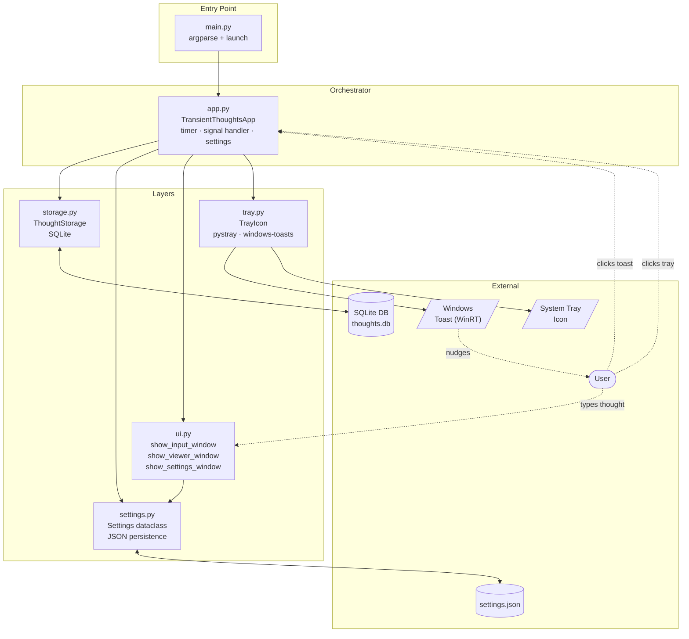

# Transient Thoughts

A small journaling app that periodically prompts for quick, transient thoughts: the mundane half-ideas that would otherwise be forgotten.

## What it does

Sits quietly in your system tray. Every so often, an unintrusive Windows toast appears reminding you to jot something down. Open the prompt from the toast, the tray icon, or a keyboard shortcut, type a thought, hit Enter, and it's filed away. Past entries are timestamped and viewable any time.

## Features

**Capture**
- Tray-resident; no taskbar clutter
- Click the Windows toast or the tray icon to open the prompt
- Global hotkey `Ctrl+Alt+T` opens the prompt from any app
- Multi-line text box (wraps to 3 visible lines, scrolls beyond)
- Enter saves, Escape cancels

**Browse**
- Dedicated "View Entries" panel: draggable, scrollable

**Configure**
- Settings panel for prompt frequency, notifications on/off, panel placement, and quiet hours (with timezone)
- Settings persist as JSON between launches

**Toast notifications (Windows)**
- Native Windows 10/11 toast via WinRT, attributed to our app name ("Transient Thoughts") and app icon
- Clicking the toast opens the prompt panel directly

**Lifecycle**
- Ctrl+C in the terminal triggers the same graceful shutdown path as the tray's Quit menu
- DPI-aware rendering on hi-DPI displays

## Keyboard shortcuts

| Panel | Key | Action |
|---|---|---|
| _anywhere_ | `Ctrl+Alt+T` | open the input prompt from any app |
| Input | `Enter` | save and close |
| Input | `Esc` | cancel |
| Input | `↑` / `↓` | scroll the text box |
| Input | `Ctrl+L` | open the viewer |
| Input | `Ctrl+S` | open settings |
| Input | `Ctrl+Q` | quit the app |
| Viewer | `Esc` | close |
| Viewer | `↑` / `↓` | scroll entries |
| Viewer | `Ctrl+S` | open settings |
| Viewer | drag header | reposition the window |
| Settings | `Enter` | save |
| Settings | `Esc` | cancel |
| Settings | drag header | reposition the window |

## Settings

Reachable from the tray menu (right-click → Settings), or `Ctrl+S` inside either panel.

| Setting | Description |
|---|---|
| **frequency** | Minutes between toast notifications (1 – 1440) |
| **notifications** | Toggle prompts entirely without uninstalling |
| **placement** | Where the input panel appears: `center`, `top-left`, `top-right`, `bottom-left`, `bottom-right` |
| **quiet hours** | Suppress notifications between two hours (24-hour clock); wraps midnight cleanly (e.g. 22 → 7) |
| **hours timezone** | Interpret quiet-hours bounds in `local` time, `UTC`, or a specific IANA zone (Americas, Europe, Asia, Pacific) |

Settings are stored at `%APPDATA%\transient-thoughts\settings.json` and reloaded into the running app on save; no restart needed.

## Architecture



Solid arrows are code dependencies (imports). Dotted arrows are runtime flow: the toast nudges the user; clicking the toast or the tray icon invokes a callback on the orchestrator, which spawns a tkinter window in a daemon thread. Submitted text flows into storage; settings changes flow into `settings.json` and back into the running `TransientThoughtsApp` instance.

## Installation

> **Note:** A native installation path for non-developers is pending. For now, installation requires the developer toolchain below.

Requires [`uv`](https://docs.astral.sh/uv/) and Python ≥3.10.

**Dev workflow** (run from the repo, picks up code changes immediately):

```bash
uv sync
uv run transient-thoughts
```

**Daily-use install** (callable from anywhere as `transient-thoughts`):

```bash
uv tool install --from . transient-thoughts
```

To uninstall: `uv tool uninstall transient-thoughts`.

## Usage

```bash
transient-thoughts                    # use the persisted interval (default 30 min)
transient-thoughts --interval 5       # override and persist the interval to settings
transient-thoughts --view             # print all entries to stdout, then exit
```

Once running, the app lives in the tray. Right-click the tray icon for **Open Prompt**, **View Entries**, **Settings**, or **Quit**; left-click is shorthand for Open Prompt.

## Project structure

```
transient_thoughts/
  __init__.py     -- package marker
  __main__.py     -- enables `python -m transient_thoughts`
  config.py       -- app-wide constants (DB path, app name)
  storage.py      -- SQLite persistence; owns the thoughts table
  settings.py     -- Settings dataclass + JSON load/save; placements + timezones
  ui.py           -- input prompt, viewer, settings panel (Tkinter)
  tray.py         -- pystray tray icon + WinRT toast + AUMID registration
  app.py          -- orchestrator: timer, signal handler, callbacks
  main.py         -- CLI entry point (argparse)
pyproject.toml    -- project metadata, dependencies, console scripts
uv.lock           -- pinned dependency versions
```

## On-disk state

Everything user-facing lives under `%APPDATA%\transient-thoughts\`:

| File | What |
|---|---|
| `thoughts.db` | SQLite database of timestamped thoughts |
| `settings.json` | Persisted Settings dataclass |
| `tray_icon.png` | Generated app icon (used by the toast AppLogo) |

A registry entry at `HKCU\Software\Classes\AppUserModelId\TransientThoughts.App` is registered on first launch so Windows attributes toasts to "Transient Thoughts" with our icon, instead of falling back to the host Python interpreter's identity.

## Requirements

- Python ≥3.10
- Windows 10+ for the native toast pipeline (WinRT via [`windows-toasts`](https://pypi.org/project/windows-toasts/)). On non-Windows platforms the app still runs but falls back to `plyer` notifications without click support, custom icon, or app-name attribution.

## License

[MIT](LICENSE)
