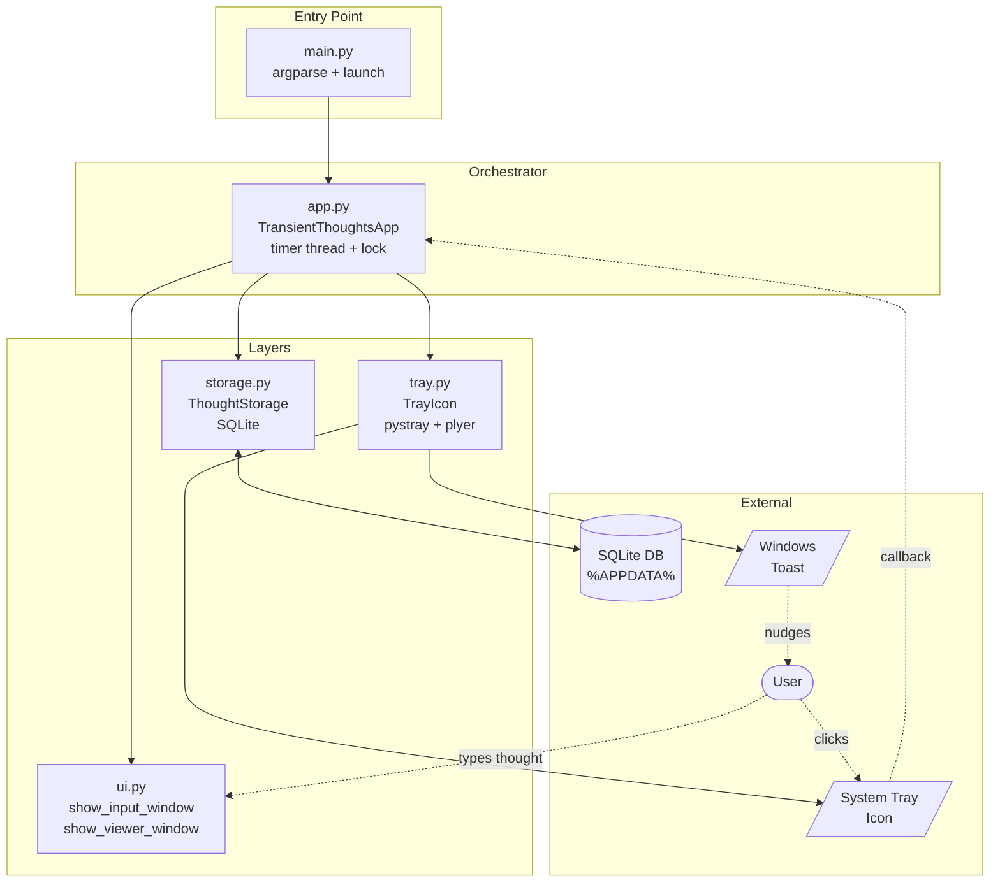

# Transient Thoughts

A small journaling app that periodically prompts for quick, transient thoughts — the mundane half-ideas that would otherwise be forgotten.

## What it does

Sits quietly in your system tray. Every so often, an unintrusive Windows toast appears reminding you to jot something down. Click the tray icon, type a sentence, hit Enter — or press Escape to skip. Past entries are timestamped and viewable any time.

## Features

- Periodic Windows toast notifications — never auto-pops a window
- Tiny single-line input box: Enter to save, Escape to skip
- System tray icon with menu: **Open Prompt**, **View Entries**, **Quit**
- SQLite storage at `%APPDATA%\transient-thoughts\thoughts.db`
- `--view` flag to dump all entries to stdout
- Configurable prompt interval via `--interval N`

## Architecture



Solid arrows are code dependencies (imports). Dotted arrows are runtime flow: the tray fires a toast, the user sees it and clicks the tray icon, that click is delivered back to the orchestrator as a callback, which spawns a tkinter input window. Submitted text flows into storage.

## Installation

Requires [`uv`](https://docs.astral.sh/uv/) and Python ≥3.10.

**Dev workflow** (run from the repo, picks up code changes immediately):

```bash
uv sync
uv run transient-thoughts
```

**Daily-use install** (callable from anywhere as `transient-thoughts`):

```bash
uv tool install --from . transient-thoughts
```

To uninstall: `uv tool uninstall transient-thoughts`.

## Usage

```bash
transient-thoughts                    # default 30-min prompt interval
transient-thoughts --interval 5       # faster cadence (5 min) — useful for testing
transient-thoughts --view             # print all entries to stdout, then exit
```

## Project structure

```
transient_thoughts/
  __init__.py     -- package marker
  __main__.py     -- enables `python -m transient_thoughts`
  config.py       -- application-wide constants (DB path, app name, prompt interval)
  storage.py      -- SQLite persistence layer; owns the thoughts table
  ui.py           -- tkinter input prompt and entry viewer
  tray.py         -- system tray icon and toast notifications
  app.py          -- orchestrator wiring storage, UI, tray; manages timer thread
  main.py         -- CLI entry point (argparse)
pyproject.toml    -- project metadata, dependencies, console script
uv.lock           -- pinned dependency versions
```

## Requirements

- Python ≥3.10
- Windows 10+ for toast notifications. The tray icon and storage layers are cross-platform; only the `plyer` notification backend is Windows-targeted in this prototype.

## License

[MIT](LICENSE)
